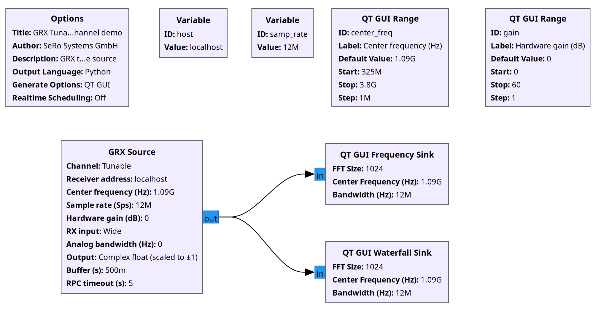

# gr-serorx

[](https://github.com/SeRoSystems/gr-serorx/releases) [](https://github.com/SeRoSystems/gr-serorx/actions/workflows/ci.yml)

A GNU Radio out-of-tree module providing a source block that streams
IQ samples from a SeRo GRX receiver. A standard ADS-B decoding
flow is also provided as an example.



## Installation

You can find a conda package for Windows (and other platforms) and
a .deb package for APT-based GNU Radio distributions under Releases.

### Conda (Windows, MacOS)

The package needs a conda environment with GNU Radio 3.10 or newer, such as
[radioconda](https://github.com/radioconda/radioconda-installer).

1. Download `gr-serorx-<version>-<build>.conda` from Releases.
2. Open the environment's prompt (Windows: the radioconda Prompt in the Start
   menu) and install the package from conda-forge, so its dependencies
   resolve with it:

   ```bash
   conda install -c conda-forge ./gr-serorx-<version>-<build>.conda
   ```

   A plain `conda install ./gr-serorx-<version>-<build>.conda` with no
   channel resolves none of the package's own dependencies. If that path
   is needed, install them first:

   ```bash
   conda install -c conda-forge gnuradio grpcio protobuf numpy pyqt
   conda install ./gr-serorx-<version>-<build>.conda
   ```

3. Verify the install: `python -c "from gnuradio import serorx; print('ok')"`.
4. Start GNU Radio Companion, or restart it if it was already running. The
   blocks appear in the category `[SeRo RX]`.

### Debian/Ubuntu (APT-based GNU Radio distributions)

The package depends on the distribution's `gnuradio` (3.10 or newer),
`python3-grpcio`, `python3-protobuf` (3.20 or newer) and `python3-numpy`.
Debian 12 and Ubuntu 24.04 or newer ship these versions.

1. Download `gr-serorx_<version>_all.deb` from Releases.
2. Install it, which pulls the dependencies:

   ```bash
   sudo apt install ./gr-serorx_<version>_all.deb
   ```

3. Verify the install: `python3 -c "from gnuradio import serorx; print('ok')"`.
4. Start GNU Radio Companion, or restart it if it was already running. The
   blocks appear in the category `[SeRo RX]`.

## Try it without hardware

`fake-grx/fake_grx.py` serves the same three gRPC services as a receiver,
with synthetic IQ, on localhost. Run it, then open an example from
`gr-serorx/examples` with `host = 'localhost'`. See [fake-grx/README.md](fake-grx/README.md).

## Usage

The block `GRX Source` connects to a receiver and streams the selected
channel. A basic ADS-B decoding chain is provided as an example. For
more information, refer to the in package README ([gr-serorx/README.md](gr-serorx/README.md)).

### Examples

You can find examples for the tunable channel and the ADS-B decoding
flow in `gr-serorx/examples`.

## Build from source

```bash
git clone https://github.com/SeRoSystems/gr-serorx
cd gr-serorx/gr-serorx
```

Build, test and packaging commands are in `gr-serorx/README.md`.

## Troubleshooting

[gr-serorx/README.md](gr-serorx/README.md) lists every failure message the block raises or
logs, at start and while the flowgraph runs, under
[Failures](gr-serorx/README.md#failures). For anything not covered there,
open an issue: https://github.com/SeRoSystems/gr-serorx/issues.
